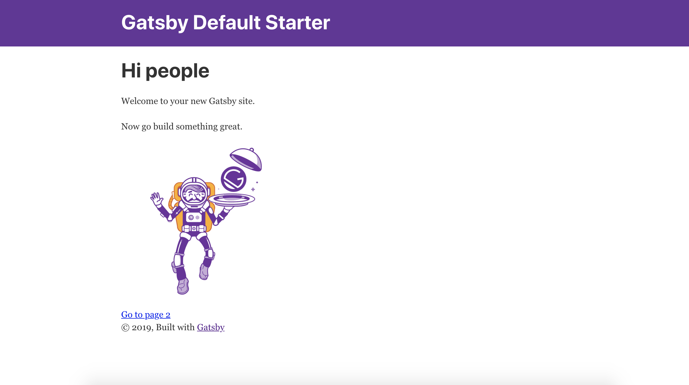
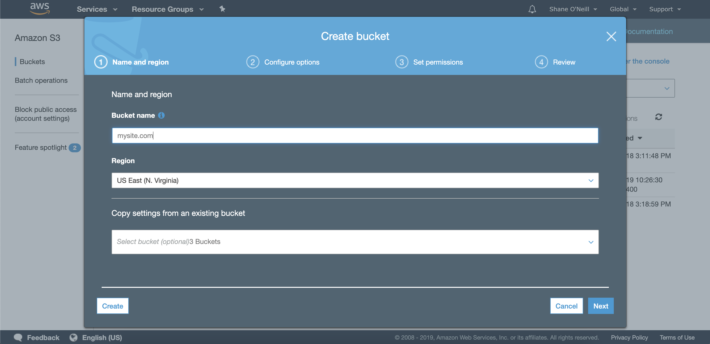
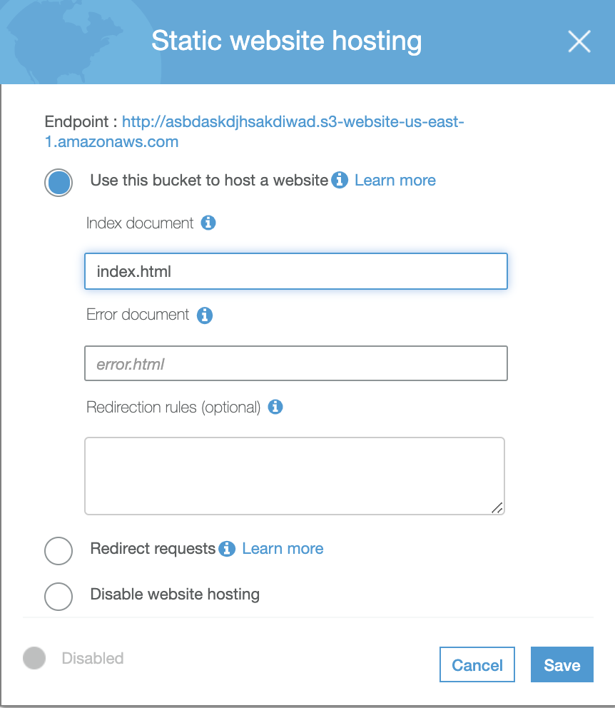
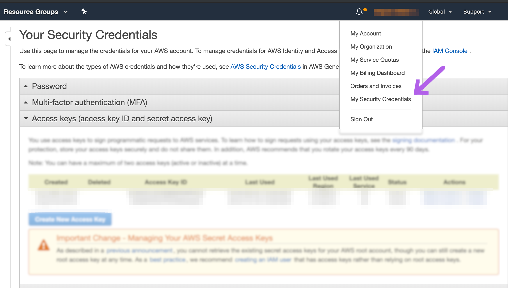
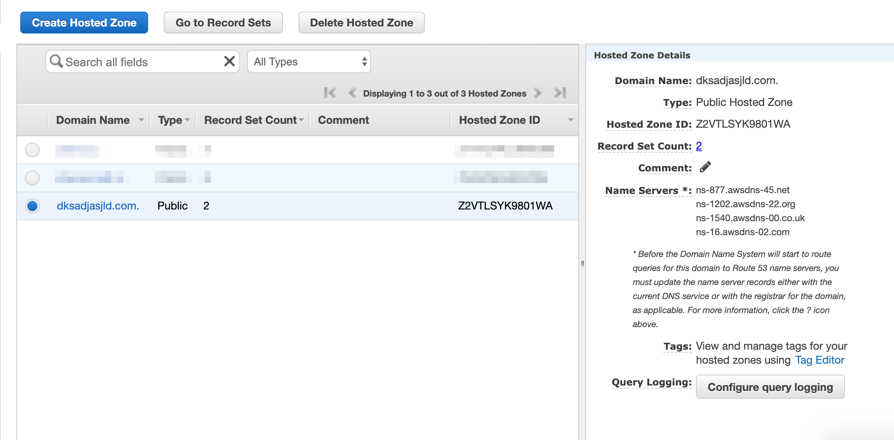
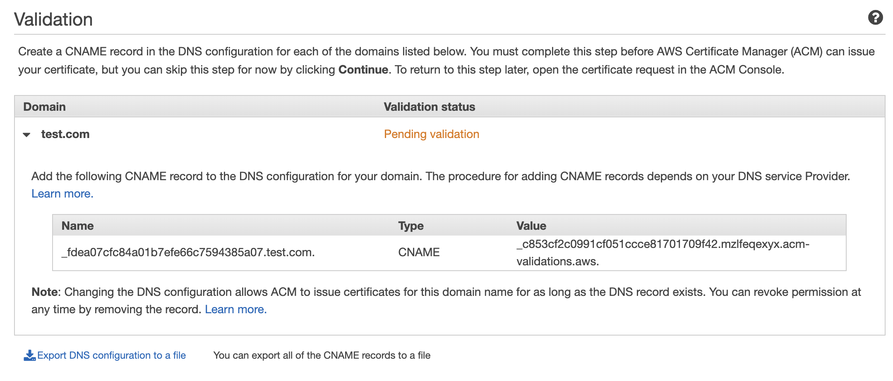
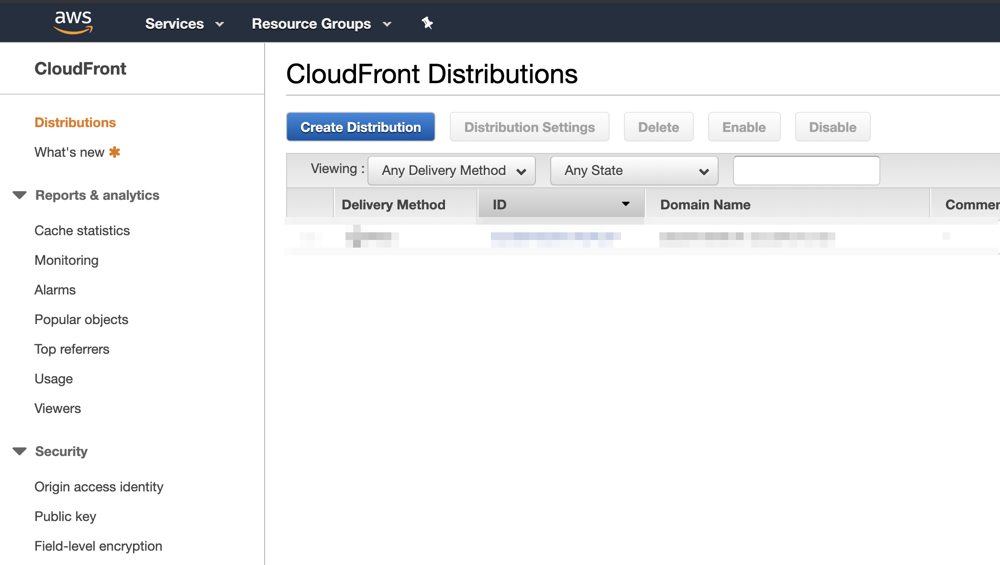

So what seems like eons ago I wrote a post on how to deploy a NodeJS app to AWS. I have recently
gotten off that setup and with the power of [Gatsby](https://www.gatsbyjs.org), we can create a
much faster wesbite that leverages modern technology patterns -- With a much better developer experience too as you can write posts in Markdown and check them into Git.

This post will be using the following stack of technologies and services:

- Gatsby
- AWS (Amazon Web Services)
  - S3
  - Route 53
  - Cloudfront
  - Certificate Manager
- Namecheap

Thats it. I believe this to be the best setup for small sites, blogs, and general use.
It doesn't involve a lot of manual heavy lifting and can get you the most bang for your buck.
This post assumes very little knowledge of both Gatsby and AWS and tries to be a thorough as possible.
Let me know how it goes on [Twitter](https://twitter.com/zeevosec).

## Part 1 -- Create your Gatsby Site

Now I won't be going through how to write your own website (Thats for you to decide!).
If you already have a Gatsby site ready to go then skip this part! There are tons of
Gatsby tutorials out there, and a lot of [starters](https://www.gatsbyjs.org/starters/?v=2).
Let's just got with a default starter.

```sh
npm install -g gatsby-cli

gatsby new my-site https://github.com/gatsbyjs/gatsby-starter-default

cd my-site

gatsby develop
```

You should see this!



## Part 2 -- Create your S3 Bucket



Log in to your AWS Console and navigate to S3. Press "Create bucket" and type in your domain name.
Keep selecting next until it is created.

### Enable static website hosting

Select your newly created bucket and go to Properties on the right. Then select "Static website hosting" and enable it with the root as "index.html".



### Allow public access

In the "Permissions" tab. Turn off the highest checkbox titled "Block all public access".
We want people to be able to access

### Set a Bucket policy

Next we need to set a good bucket policy where visitors can read everything from our bucket,
but not do anything else. This may sound weird to allow everyone access to read our Bucket,
but this is exactly how websites work. We _want_ web browsers to be able to request files from
our Bucket. To the right of the Properties tag, select Permissions. Then select "Bucket Policy".
You can then type or copy and paste the following in the Bucket policy editor. Replace
where appropriate below with your own bucket name.

```sh
{
    "Version": "2012-10-17",
    "Id": "Policy1567132375075",
    "Statement": [
        {
            "Sid": "Stmt1567132352689",
            "Effect": "Allow",
            "Principal": "*",
            "Action": "s3:GetObject",
            "Resource": "arn:aws:s3:::YOUR_BUCKET_NAME_HERE/*"
        }
    ]
}
```


## Part 3 -- AWS CLI and Deploying to S3

First, install the [AWS CLI](https://aws.amazon.com/cli/) AWS CLI if you have not already done so.
If you are on a Mac and have `brew`, then you can just run `brew install awscli`.

Next, we need some secrets. In AWS, select the "My Security Credentials" drop down by your name.



Select the big blue "Create New Access Key" to create a pair. Store this securely.

Now let's configure our AWS profile on our machine. In a terminal, run...

```sh
$ aws configure
```

Follow the instructures and enter in your AWS Access Key ID and AWS Secret Access Key.
Your region should be the region that your S3 bucket is. Output format JSON.

Back within your Gatsby site, open up a terminal and install `gatsby-plugin-s3`

```sh
$ npm i gatsby-plugin-s3 --save
```

Back in your Gatsby site, open up the `gatsby-config.js` file. Add the following entry to your `plugins` array.

```js
{
  resolve: 'gatsby-plugin-s3',
  options: {
    bucketName: 'YOUR BUCKET NAME',
  },
},
```

Replace where appropriate with your bucket name. In `package.json`, add a deployment script.

```js
"scripts": {
   ...
   "deploy": "gatsby-plugin-s3 deploy"
}
```

Now, in a terminal, let's try to deploy our site.

```sh
$ npm run build && npm run deploy
```

Navigating to your bucket in your browser should display your site. If you do not know your bucket URL, go back to S3 and click your bucket and go to properties. Then click Static Website Hosting. Your URL should be at the top of the small box that opens (like in Part 1). Remember this URL.

So, success right? Next, we need to configure HTTPS with our domain name.

## Part 4 -- DNS and HTTPS

We do not want to have to use a URL like `http://some-bucket-name.s3-website.us-east-2.amazonaws.com/` forever.
That's just bad branding. Buy your desired domain name off of [Namecheap](https://www.namecheap.com),
or some other domain registrar. Personally, I like namecheap. We'll be using three more Amazon services
to get this working: Cloudfront, Certificate Manager, and Route 53.

### Route 53

Navigate to your AWS Console and search for the service named "Route 53". Route 53 allows us to
route end users to applications by translating names like www.example.com to IP Addresses or Buckets.
It will also allow us to setup HTTPS.

In Route 53, select create hosted zone. Create just a base Hosted Zone for now. The key component here
is getting your Name Servers.



To the right you will see your Name Servers. Now you will have to do little research
by yourself now. What we need to do it configure our domain to use these Name Servers
as "Custom DNS". In Namecheap, this is very easy to do and there is tons of resources
online on how to do it within your Namecheap dashboard. So give it a google.

### Certificate Manager

Before we can put our domain name behind https, we will need an SSL certificate.
Luckily, AWS has a manager for this.
It's called [Certificate Manager](https://aws.amazon.com/certificate-manager/). Let's make one.

In your AWS Console, search for Certifcate Manager and navigate to it. Select "Request a certificate".
Select "Request a public certificate", and keep going.


Next, add your domain names. If your domain is "example.com", I would add...

- example.com
- www.example.com

Keep going and make sure you select **DNS validation**. Now, you will see your CNAMEs you have to do to your DNS record. This is how Amazon knows you are the owner of this certificate.



Navigate back to Route 53 and both the name and value under type CNAME to your site's hosted zone.
If you added both "example.com" and "www.example.com". You should have 6 Record Sets: two A records,
NS record, SOA, and two CNAME records. It can take a few minutes to validate.

### Namecheap or other domain name registrar

If you are using Namecheap or other service, make sure you are using your Route 53 Name servers for
your domain.

### Cloudfront



Navigate to the Cloudfront console by searching for it in your AWS Management Console. Choose "Create distribution" and under Web, select Get Started. Now you will be prompted for a variety of settings. Fill these out with the following:

**Origin Domain Name**

- This should be your bucket URL. Aka `http://some-bucket-name.s3-website.us-east-2.amazonaws.com/` for us-east-2.
  If you do not know your bucket URL see Part 1.

**Origin ID**

- This should be `S3-your-bucket-name`.

**Viewer Protocol Policy**

- Select "Redirect HTTP to HTTPS" or whatever you like for this.

**Alternate Domain Names**

- Type in the URLs for your site. i.e. if your site is example.com, you would type "example.com" and "www.example.com" (seperated by a newline).

**SSL Certificate**

- Import the certificate you made earlier with Certificate Manager.

## Try it out!

Of you deployed your site into your bucket earlier, navigating to your domain name should produce it!
Try it out.

### Common issues

- Make sure your domain name registrar is using Route 53's Name Servers
- Update Route 53 with Certificate Manager's CNAMEs
- Double check your bucket policy

### Feedback

If anything in this post is not clear, or if there is a better way (with AWS, I'm sure there is),
let me know on [Twitter](https://twitter.com/zeevosec)!
